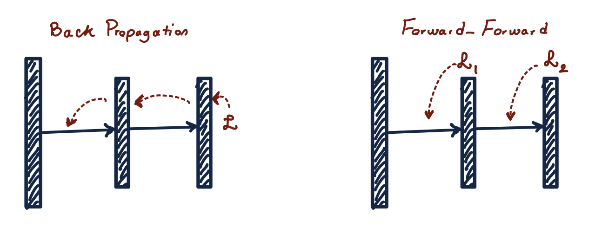

# Single Layer Individual Training

This project is all about exploration, as we introduce a novel training method called 'Single Layer Individual Training,' drawing inspiration from the Forward Forward algorithm presented at [Geoffrey Hinton's talk at NeurIPS 2022](https://www.cs.toronto.edu/~hinton/FFA13.pdf).\. Our aim is to examine its potential across various scenarios. We've organized a set of experiments to investigate how this method performs when combined with different objective functions within the context of the Forward Forward algorithm. Our focus is on its adaptability and performance within different algorithms, including Dense Neural Networks, CNNs, and VIT, applied to datasets like Cifar-10 and MNISTIntuition.

Forward Forward algorithm
---
The idea is to replace backpropagation's forward and backward passes with two identical forward passes, each operating on distinct data with opposing objectives. Each layer has its unique goal, with the positive pass enhancing goodness in hidden layers using real data, and the negative pass decreasing it with "negative data."

Backpropagation has limitations: it doesn't mirror how the brain learns, lacks evidence from the visual system, and struggles with sequences and real-time learning. It depends on a precise forward computation model for accurate derivatives. However, by separating the positive and negative passes in time, we could simplify learning, enabling offline processing and uninterrupted video processing without the need to store activities or halt derivative propagation.

Experiments and Loss Function
---

In our project 'SLIT,' we developed a novel neural network training method inspired by the Forward-Forward algorithm. This approach involved training each neural network layer individually. Initially, we experimented with using the mean of layer activations as a goodness function to predict class labels and employed the Mean Squared Error (MSE) loss function to update the weights in the corresponding layer. However, we encountered a significant challenge. The mean-based approach failed to effectively capture relationships between different classes, resulting in poor performance with a high 12% error rate on the MNIST dataset. For instance, our training method forced the model to learn that the digits 7 and 8 are similar as the loss function meant their feature means are very close, even though, visually, 8 is more similar to 3 than to 7. Consequently, our model struggled to learn meaningful features.

To address this issue, we divided the number of neurons into groups matching the number of classes. Each group of neurons was responsible for learning class-specific features, while subsequent layers adjusted the weights to create shared feature representations. This process resulted in the formation of more complex, composite features at higher levels, which combined the common features across classes. This approach streamlined the training process for densely connected networks. For Convolutional Neural Networks (CNNs), we extended a similar concept by partitioning the total number of filters into class-specific groups. Each set of filters was dedicated to learning features associated with a particular class, and subsequent network layers integrated these shared features to unveil more comprehensive class-specific attributes, effectively enabling multi-layer learning.

Our objective function is the multiclass hinge loss. In our model, each group of features (represented by a set of neurons in a deep neural network or a set of filters in a convolutional neural network) represents a class. This loss function ensures that the correct class's score is higher than incorrect classes by a specified margin. If this margin isn't met, the loss is positive and prompts model improvement.
 
**MultiClass Hinge loss: $\max(0,Y_{Pred}-Y_{Original}+Margin)$**

During training, our aim is to minimize this loss function. This process encourages the model to make accurate classifications while maximizing the separation between the correct class and the incorrect ones. Additionally, it enables the model to capture similarities between different classes when their scores are close.

Results
---
|                         |No.of Hidden layers|Epochs|Train erorr| Test erorr| 
|-------------------------|:-------------------:|-----------|-----------|------|
|Backprop_MNIST_DNN       |3|10|0.41%|2.22%|
|Backprop_MNIST_CNN       |4|10|0.13%|1.17%|
|Forward-Forward_MNIST    | 4|60|-|1.36%|
|SLIT_MNIST_DNN           | 3|10|0.28%|2.14%|
|SLIT_MNIST_CNN           | 3|30|0.51%|0.98%|
|Forward-Forward_CIFAR10 (using non-convolutional nets with local receptive fields) |3|-|24%|41%|
|SLIT_CIFAR10_CNN             |3|[80,40,20]|11.96%|25.21%|

